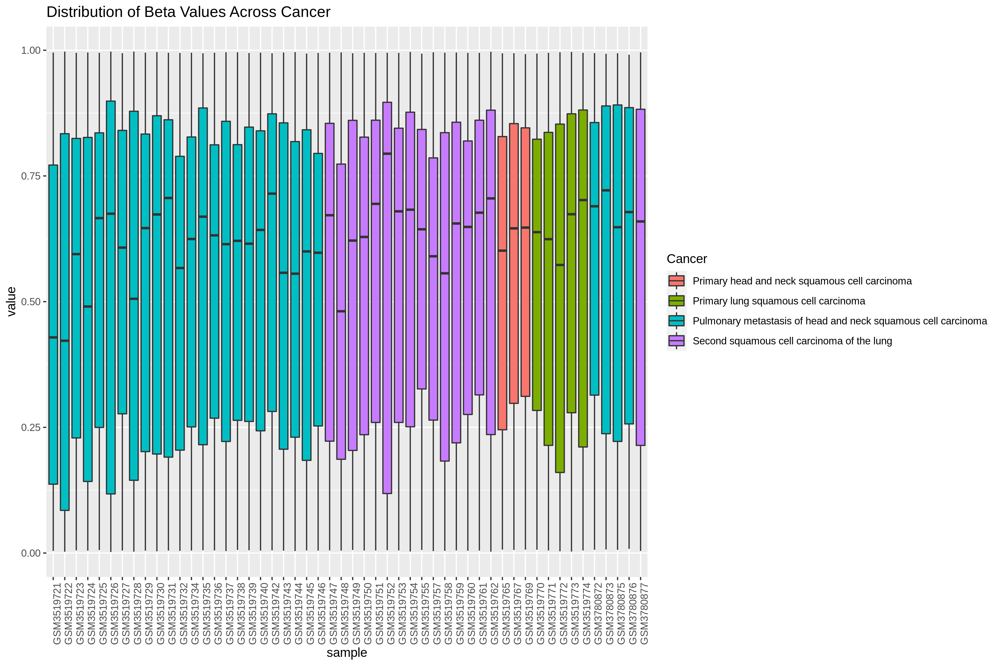
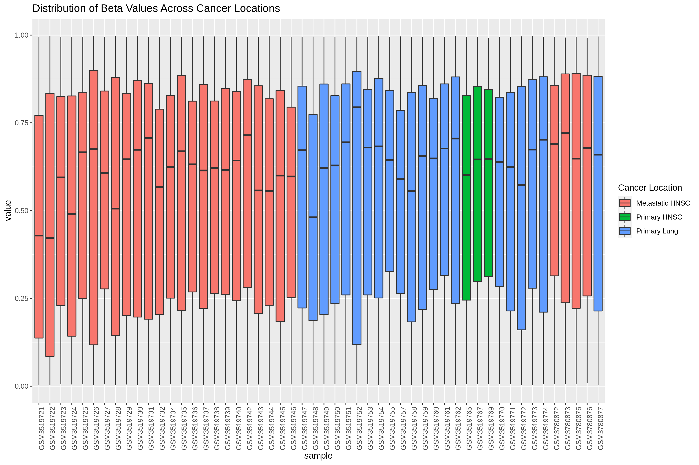
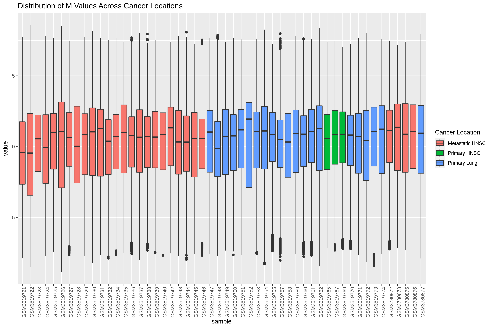
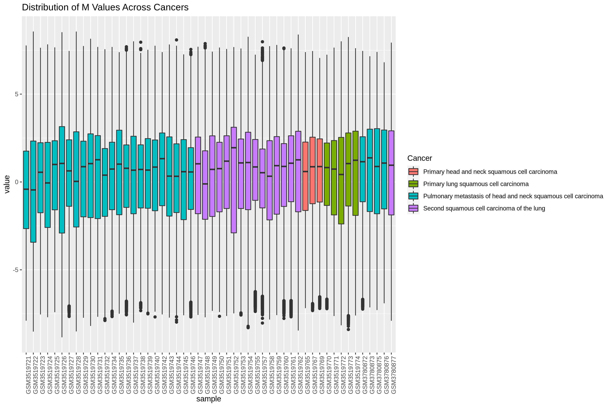
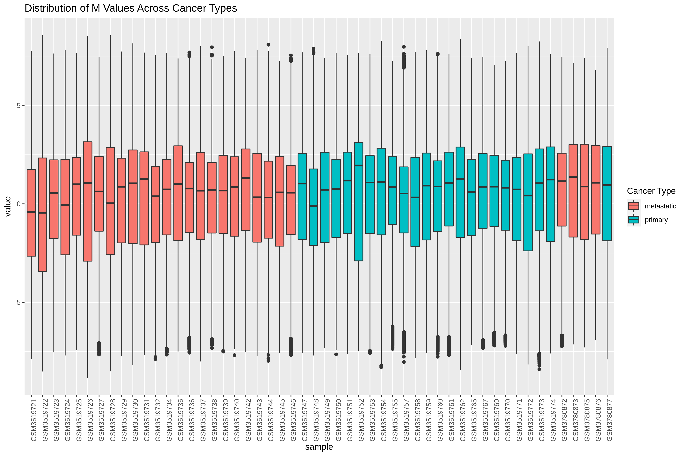

```{r setup, include=FALSE}
knitr::opts_chunk$set(echo = FALSE)
library(here)
library(knitr)
```

### Final results

Beta value distribution across samples, by `cancer`:



Beta value distribution across samples, by `cancer_type`:


### Scratch Results

Beta value distribution across samples, by `cancer_loc`:



M value distribution across samples, by `cancer_loc`:



M value distribution across samples, by `cancer`:




M value distribution across samples by `cancer_type`:



