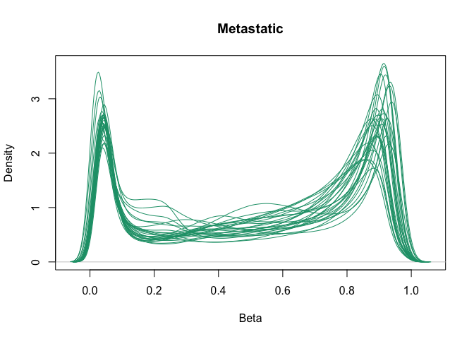
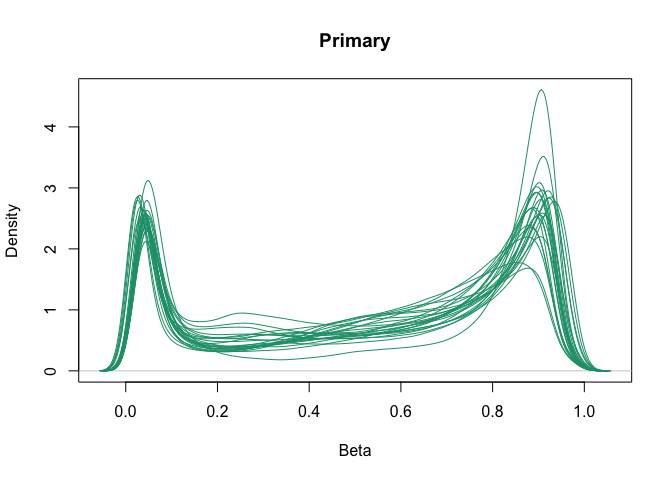
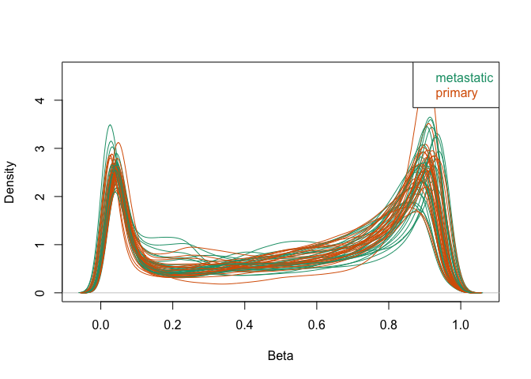

Betas By Sample
================
Almas K.
2020-03-13

Libraries
---------

``` r
library(minfi)
```

    ## Loading required package: BiocGenerics

    ## Loading required package: parallel

    ## 
    ## Attaching package: 'BiocGenerics'

    ## The following objects are masked from 'package:parallel':
    ## 
    ##     clusterApply, clusterApplyLB, clusterCall, clusterEvalQ,
    ##     clusterExport, clusterMap, parApply, parCapply, parLapply,
    ##     parLapplyLB, parRapply, parSapply, parSapplyLB

    ## The following objects are masked from 'package:stats':
    ## 
    ##     IQR, mad, sd, var, xtabs

    ## The following objects are masked from 'package:base':
    ## 
    ##     anyDuplicated, append, as.data.frame, basename, cbind, colnames,
    ##     dirname, do.call, duplicated, eval, evalq, Filter, Find, get, grep,
    ##     grepl, intersect, is.unsorted, lapply, Map, mapply, match, mget,
    ##     order, paste, pmax, pmax.int, pmin, pmin.int, Position, rank,
    ##     rbind, Reduce, rownames, sapply, setdiff, sort, table, tapply,
    ##     union, unique, unsplit, which, which.max, which.min

    ## Loading required package: GenomicRanges

    ## Loading required package: stats4

    ## Loading required package: S4Vectors

    ## 
    ## Attaching package: 'S4Vectors'

    ## The following object is masked from 'package:base':
    ## 
    ##     expand.grid

    ## Loading required package: IRanges

    ## Loading required package: GenomeInfoDb

    ## Loading required package: SummarizedExperiment

    ## Loading required package: Biobase

    ## Welcome to Bioconductor
    ## 
    ##     Vignettes contain introductory material; view with
    ##     'browseVignettes()'. To cite Bioconductor, see
    ##     'citation("Biobase")', and for packages 'citation("pkgname")'.

    ## Loading required package: DelayedArray

    ## Loading required package: matrixStats

    ## 
    ## Attaching package: 'matrixStats'

    ## The following objects are masked from 'package:Biobase':
    ## 
    ##     anyMissing, rowMedians

    ## Loading required package: BiocParallel

    ## 
    ## Attaching package: 'DelayedArray'

    ## The following objects are masked from 'package:matrixStats':
    ## 
    ##     colMaxs, colMins, colRanges, rowMaxs, rowMins, rowRanges

    ## The following objects are masked from 'package:base':
    ## 
    ##     aperm, apply, rowsum

    ## Loading required package: Biostrings

    ## Loading required package: XVector

    ## 
    ## Attaching package: 'Biostrings'

    ## The following object is masked from 'package:DelayedArray':
    ## 
    ##     type

    ## The following object is masked from 'package:base':
    ## 
    ##     strsplit

    ## Loading required package: bumphunter

    ## Loading required package: foreach

    ## Loading required package: iterators

    ## Loading required package: locfit

    ## locfit 1.5-9.1    2013-03-22

    ## Setting options('download.file.method.GEOquery'='auto')

    ## Setting options('GEOquery.inmemory.gpl'=FALSE)

``` r
library(tidyverse)
```

    ## ── Attaching packages ─────────────────────────────────────────────────────────────────── tidyverse 1.3.0 ──

    ## ✓ ggplot2 3.2.1     ✓ purrr   0.3.3
    ## ✓ tibble  2.1.3     ✓ dplyr   0.8.4
    ## ✓ tidyr   1.0.2     ✓ stringr 1.4.0
    ## ✓ readr   1.3.1     ✓ forcats 0.4.0

    ## ── Conflicts ────────────────────────────────────────────────────────────────────── tidyverse_conflicts() ──
    ## x purrr::accumulate() masks foreach::accumulate()
    ## x dplyr::collapse()   masks Biostrings::collapse(), IRanges::collapse()
    ## x dplyr::combine()    masks minfi::combine(), Biobase::combine(), BiocGenerics::combine()
    ## x purrr::compact()    masks XVector::compact()
    ## x dplyr::count()      masks matrixStats::count()
    ## x dplyr::desc()       masks IRanges::desc()
    ## x tidyr::expand()     masks S4Vectors::expand()
    ## x dplyr::filter()     masks stats::filter()
    ## x dplyr::first()      masks S4Vectors::first()
    ## x dplyr::lag()        masks stats::lag()
    ## x ggplot2::Position() masks BiocGenerics::Position(), base::Position()
    ## x purrr::reduce()     masks GenomicRanges::reduce(), IRanges::reduce()
    ## x dplyr::rename()     masks S4Vectors::rename()
    ## x purrr::simplify()   masks DelayedArray::simplify()
    ## x dplyr::slice()      masks XVector::slice(), IRanges::slice()
    ## x purrr::when()       masks foreach::when()

``` r
library(reshape2)
```

    ## 
    ## Attaching package: 'reshape2'

    ## The following object is masked from 'package:tidyr':
    ## 
    ##     smiths

``` r
library(here)
```

    ## here() starts at /Users/almas/Documents/GitHub/Repo_team_The-Splice-Girls_W2020

Load Data
---------

``` r
raw_dat <- readRDS(here("data", "raw_data", "data.rds"))
filtered_metadata <- readRDS(here("data","processed_data","metadata.rds"))
```

Filter Loaded Data:
-------------------

``` r
male_metadata <- filtered_metadata %>%
  filter(sex=="Male")
data_to_clust <- raw_dat %>%
  dplyr::select_if((names(.) %in% male_metadata$sample)) %>%
  drop_na() 
```

Generating Beta plots per sample
--------------------------------

``` r
metastatic <- filter(male_metadata,male_metadata$cancer_type=="metastatic")
primary <- filter(male_metadata,!(male_metadata$cancer_type=="metastatic"))
groups <- male_metadata$cancer_type
metastatic_methyl <- data_to_clust %>%
     dplyr::select_if((names(.) %in% metastatic$sample))
primary_methyl <- data_to_clust %>%
     dplyr::select_if((names(.) %in% primary$sample))

minfi::densityPlot(as.matrix(metastatic_methyl),main="Metastatic")
```



``` r
minfi::densityPlot(as.matrix(primary_methyl),main="Primary")
```



``` r
minfi::densityPlot(as.matrix((data_to_clust)),sampGroups = groups)
```


