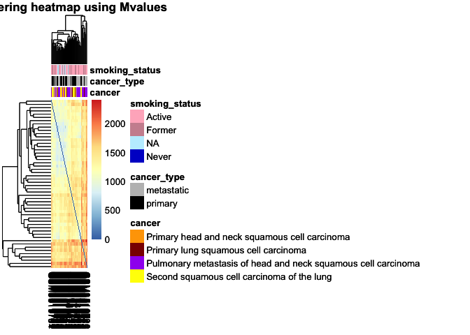
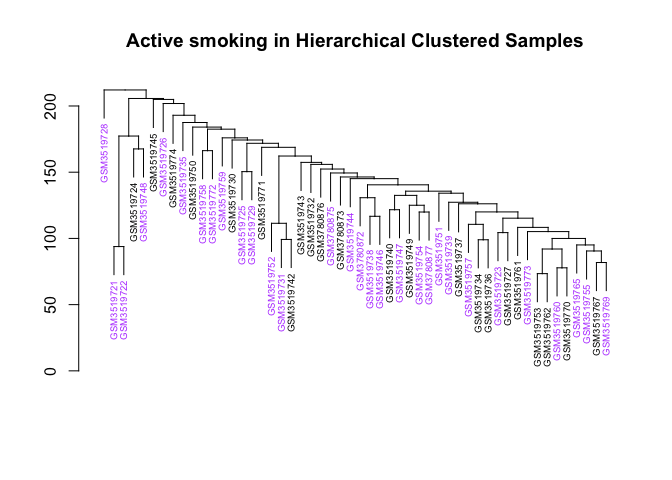

hierarchical\_clustering
================
Almas K.
2020-03-10

Libraries
---------

``` r
library(tidyverse)
```

    ## ── Attaching packages ─────────────────────────────────────────────────────── tidyverse 1.3.0 ──

    ## ✓ ggplot2 3.3.0     ✓ purrr   0.3.3
    ## ✓ tibble  3.0.0     ✓ dplyr   0.8.5
    ## ✓ tidyr   1.0.2     ✓ stringr 1.4.0
    ## ✓ readr   1.3.1     ✓ forcats 0.5.0

    ## ── Conflicts ────────────────────────────────────────────────────────── tidyverse_conflicts() ──
    ## x dplyr::filter() masks stats::filter()
    ## x dplyr::lag()    masks stats::lag()

``` r
library(reshape2)
```

    ## 
    ## Attaching package: 'reshape2'

    ## The following object is masked from 'package:tidyr':
    ## 
    ##     smiths

``` r
library(stringr)
library(here)
```

    ## here() starts at /Users/almas/Documents/GitHub/Repo_team_The-Splice-Girls_W2020

``` r
library(tictoc)
library(ggdendro)
library(dendextend)
```

    ## 
    ## ---------------------
    ## Welcome to dendextend version 1.13.4
    ## Type citation('dendextend') for how to cite the package.
    ## 
    ## Type browseVignettes(package = 'dendextend') for the package vignette.
    ## The github page is: https://github.com/talgalili/dendextend/
    ## 
    ## Suggestions and bug-reports can be submitted at: https://github.com/talgalili/dendextend/issues
    ## Or contact: <tal.galili@gmail.com>
    ## 
    ##  To suppress this message use:  suppressPackageStartupMessages(library(dendextend))
    ## ---------------------

    ## 
    ## Attaching package: 'dendextend'

    ## The following object is masked from 'package:ggdendro':
    ## 
    ##     theme_dendro

    ## The following object is masked from 'package:stats':
    ## 
    ##     cutree

``` r
library(lumi)
```

    ## Loading required package: Biobase

    ## Loading required package: BiocGenerics

    ## Loading required package: parallel

    ## 
    ## Attaching package: 'BiocGenerics'

    ## The following objects are masked from 'package:parallel':
    ## 
    ##     clusterApply, clusterApplyLB, clusterCall, clusterEvalQ,
    ##     clusterExport, clusterMap, parApply, parCapply, parLapply,
    ##     parLapplyLB, parRapply, parSapply, parSapplyLB

    ## The following objects are masked from 'package:dplyr':
    ## 
    ##     combine, intersect, setdiff, union

    ## The following objects are masked from 'package:stats':
    ## 
    ##     IQR, mad, sd, var, xtabs

    ## The following objects are masked from 'package:base':
    ## 
    ##     anyDuplicated, append, as.data.frame, basename, cbind, colnames,
    ##     dirname, do.call, duplicated, eval, evalq, Filter, Find, get, grep,
    ##     grepl, intersect, is.unsorted, lapply, Map, mapply, match, mget,
    ##     order, paste, pmax, pmax.int, pmin, pmin.int, Position, rank,
    ##     rbind, Reduce, rownames, sapply, setdiff, sort, table, tapply,
    ##     union, unique, unsplit, which, which.max, which.min

    ## Welcome to Bioconductor
    ## 
    ##     Vignettes contain introductory material; view with
    ##     'browseVignettes()'. To cite Bioconductor, see
    ##     'citation("Biobase")', and for packages 'citation("pkgname")'.

    ## Setting options('download.file.method.GEOquery'='auto')

    ## Setting options('GEOquery.inmemory.gpl'=FALSE)

    ## No methods found in package 'RSQLite' for request: 'dbListFields' when loading 'lumi'

Load Data
---------

``` r
raw_dat <- readRDS(here("data", "raw_data", "data.rds"))
filtered_metadata <- readRDS(here("data","processed_data","metadata.rds"))
```

Filter Loaded Data:
-------------------

``` r
male_metadata <- filtered_metadata %>%
  filter(sex=="Male")
rownames(male_metadata) <- male_metadata$sample
data_to_clust <- raw_dat
rownames(data_to_clust) <- data_to_clust$CG
data_to_clust <- data_to_clust %>%
  dplyr::select_if((names(.) %in% male_metadata$sample)) %>%
  drop_na() 

filt_data <- raw_dat %>%
   dplyr::select_if((names(.) %in% male_metadata$sample)|names(.)=="CG") %>%
  drop_na() 

male_metadata %>%
  group_by(cancer) %>%
  tally()
```

    ## # A tibble: 4 x 2
    ##   cancer                                                            n
    ##   <fct>                                                         <int>
    ## 1 Primary head and neck squamous cell carcinoma                     3
    ## 2 Primary lung squamous cell carcinoma                              5
    ## 3 Pulmonary metastasis of head and neck squamous cell carcinoma    28
    ## 4 Second squamous cell carcinoma of the lung                       16

``` r
data_mval <- beta2m(data_to_clust)
```

Hierarchical Clustering and Heatmap
-----------------------------------

``` r
#distance
D <- dist(t(data_to_clust)) 
# t flips the x and y dimensions, b/c the dist measure uses rows, and we want to look at column similarity we transpose,

# clustering
clust <- hclust(D,method="average")
dendo <- as.dendrogram(clust) 


dendo %>%
  hang.dendrogram() %>%
plot(horiz=F, main="Dendogram of Males Clustered Usin Euclidean and Average Linkage")
```


``` r
heatmap <- pheatmap::pheatmap(as.matrix(D))
heatmap
```


``` r
## We can change the colours of the covariates
png( width = 1000, height = 800,here("results","final","heatmap_with_clusters.png") )
var1 = c("orange1", "darkred","purple","yellow")
names(var1) = levels(male_metadata$cancer)
var2 = c("grey", "black")
names(var2)= levels(male_metadata$cancer_type)
var3 = c("pink1", "pink3", "lightblue1", "blue3")
names(var3)=levels(male_metadata$smoking_status)
covar_color = list(cancer = var1, cancer_type = var2, smoking_status = var3)

clust_scale = "none"  
covar_color = list(cancer = var1, cancer_type= var2, smoking_status= var3)
heatmap <- pheatmap::pheatmap(as.matrix(D),cluster_rows = TRUE, scale = clust_scale, 
    clustering_method = "average", clustering_distance_cols = "euclidean", 
    show_rownames = FALSE, main = "Clustering heatmap ", annotation = male_metadata[, 
        c("cancer", "cancer_type", "smoking_status")], annotation_colors = covar_color)
heatmap
```


``` r
dev.off()
```

    ## quartz_off_screen 
    ##                 3

Using M-values

``` r
#distance
D_mval <- dist(t(data_mval)) 
# t flips the x and y dimensions, b/c the dist measure uses rows, and we want to look at column similarity we transpose
heatmap2 <- pheatmap::pheatmap(as.matrix(D_mval),cluster_rows = TRUE, scale = clust_scale, 
    clustering_method = "average", clustering_distance_cols = "euclidean", 
    show_rownames = FALSE, main = "Clustering heatmap using Mvalues ", annotation = male_metadata[, 
        c("cancer", "cancer_type", "smoking_status")], annotation_colors = covar_color)
heatmap2
```



``` r
cluster_samples <- cutree(heatmap$tree_col, k = 10)
# cluster_genes = cutree(my_heatmap_obj$tree_row, k=100)
knitr::kable(cluster_samples)
```

|            |    x|
|------------|----:|
| GSM3519721 |    1|
| GSM3519722 |    1|
| GSM3519723 |    2|
| GSM3519724 |    1|
| GSM3519725 |    3|
| GSM3519726 |    4|
| GSM3519727 |    2|
| GSM3519728 |    5|
| GSM3519729 |    3|
| GSM3519730 |    3|
| GSM3519731 |    2|
| GSM3519732 |    3|
| GSM3519734 |    2|
| GSM3519735 |    6|
| GSM3519736 |    2|
| GSM3519737 |    2|
| GSM3519738 |    2|
| GSM3519739 |    2|
| GSM3519740 |    2|
| GSM3519742 |    2|
| GSM3519743 |    2|
| GSM3519744 |    2|
| GSM3519745 |    7|
| GSM3519746 |    2|
| GSM3519747 |    2|
| GSM3519748 |    8|
| GSM3519749 |    2|
| GSM3519750 |    9|
| GSM3519751 |    2|
| GSM3519752 |   10|
| GSM3519753 |    2|
| GSM3519754 |    2|
| GSM3519755 |    2|
| GSM3519757 |    2|
| GSM3519758 |    8|
| GSM3519759 |    8|
| GSM3519760 |    2|
| GSM3519761 |    2|
| GSM3519762 |    2|
| GSM3519765 |    2|
| GSM3519767 |    2|
| GSM3519769 |    2|
| GSM3519770 |    2|
| GSM3519771 |    8|
| GSM3519772 |    8|
| GSM3519773 |    2|
| GSM3519774 |    4|
| GSM3780872 |    2|
| GSM3780873 |    2|
| GSM3780875 |    2|
| GSM3780876 |    2|
| GSM3780877 |    2|

``` r
plot(clust, labels = male_metadata$sample, cex = 0.6, main = "Average Linkage showing 10 clusters")
rect.hclust(clust, k = 10)
```


``` r
plot(clust, labels = male_metadata$origin, cex = 0.6, main = "Average Linkage showing 10 clusters")
rect.hclust(clust, k = 10)
```


``` r
plot(clust, labels = male_metadata$cancer, cex = 0.6, main = "Average Linkage showing 10 clusters")
rect.hclust(clust, k = 10)
```


``` r
plot(clust, labels = male_metadata$cancer_type, cex = 0.6, main = "Average Linkage showing 10 clusters")
rect.hclust(clust, k = 10)
```


``` r
plot(clust, labels = male_metadata$smoking_status, cex = 0.6, main = "Average Linkage showing 10 clusters")
rect.hclust(clust, k = 10)
```


``` r
Active_smoking <-male_metadata %>% filter(as.character(smoking_status) =="Active ") %>% pull(sample) # Space in active smoker category
smoking_col_dendo <- dendo %>%
  set("labels_cex", 0.6) %>%
    color_labels(labels = Active_smoking,col="#B84EFF") %>% 
  hang.dendrogram %>% 
  plot(horiz = F,main="Active smoking in Hierarchical Clustered Samples")
```



``` r
cancer_met <- male_metadata %>% filter(cancer_type=="metastatic") %>%
  pull(sample)
  
cancer_col_dendo <- dendo %>%
  set("labels_cex", 0.6) %>%
    color_labels(labels = cancer_met,col="red") %>% 
  hang.dendrogram %>% 
  plot(horiz = F,main="Metastatic cancer in Hierarchical Clustered Samples")
```


``` r
write_csv(male_metadata,here("data","raw_data","male_metadata.csv"))
```

``` r
saveRDS(data_to_clust,here("data","raw_data","data_for_limma.rds"))
```
