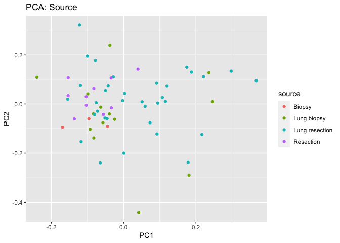
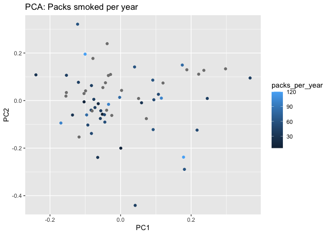
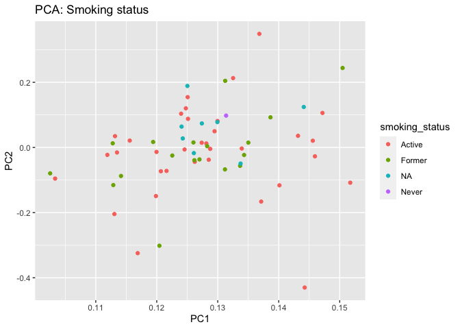
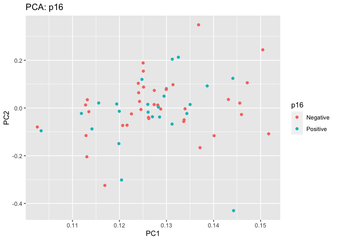

pca\_boxplot
================
Diana Lin
3/9/2020

## PCA

Load packages:

``` r
library(tidyverse)
library(here)
library(lumi)
```

Import the metadata and expression data:

``` r
if (!exists("metadata", inherits = FALSE) ) {
    metadata <-
        readRDS(file = here("data", "processed_data", "metadata.rds"))
}

if (!exists("expr", inherits = FALSE)) {
    expr <- readRDS(file = here("data","raw_data", "data.rds")) %>%
        column_to_rownames(var = "CG")
}

if(!exists("combined", inherits = FALSE)) {
    combined <- readRDS(file = here("data","processed_data","filtered_data.rds"))
}
```

PCA Bar Chart:

``` r
if (!exists("scaled", inherits = FALSE)) {
    if (file.exists(here("data", "processed_data", "scaled.rds"))) {
        scaled <- readRDS(file = here("data", "processed_data", "scaled.rds"))
    } else {
        scaled <- t(scale(t(expr)))
        saveRDS(scaled, file = here("data", "processed_data", "scaled.rds"))
    }
} 
pcs <- prcomp(na.omit(scaled), center = FALSE, scale = FALSE)
plot(pcs)
```

<!-- -->

``` r
prinComp <-
    cbind(metadata, pcs$rotation[metadata$sample, 1:10]) %>% 
    dplyr::select(-sample)
    
plot(prinComp[, c("cancer", "PC1", "PC2", "PC3")], pch = 19, cex = 0.8)
```

<!-- -->

PCA for Source:

``` r
ggplot(prinComp, aes(x = PC1, y = PC2)) +
        geom_point(aes(colour = source)) +
        ggtitle("PCA: Source")
```

<!-- -->

PCA for Cancer:

``` r
ggplot(prinComp, aes(x = PC1, y = PC2)) +
        geom_point(aes(colour = cancer)) +
        ggtitle("PCA: Cancer")
```

<!-- -->

PCA for Sex:

``` r
ggplot(prinComp, aes(x = PC1, y = PC2)) +
        geom_point(aes(colour = sex)) +
        ggtitle("PCA: Sex")
```

<!-- -->

PCA for Age:

``` r
ggplot(prinComp, aes(x = PC1, y = PC2)) +
        geom_point(aes(colour = age)) +
        ggtitle("PCA: Age")
```

<!-- -->

PCA for Smoking status:

``` r
ggplot(prinComp, aes(x = PC1, y = PC2)) +
        geom_point(aes(colour = smoking_status)) +
        ggtitle("PCA: Smoking status")
```

<!-- -->

PCA for Packs smoked per year:

``` r
ggplot(prinComp, aes(x = PC1, y = PC2)) +
        geom_point(aes(colour = packs_per_year)) +
        ggtitle("PCA: Packs smoked per year")
```

<!-- -->

PCA for HPV status:

``` r
ggplot(prinComp, aes(x = PC1, y = PC2)) +
        geom_point(aes(colour = hpv)) +
        ggtitle("PCA: HPV status")
```

<!-- -->

PCA for p16:

``` r
ggplot(prinComp, aes(x = PC1, y = PC2)) +
        geom_point(aes(colour = p16)) +
        ggtitle("PCA: p16")
```

<!-- -->

PCA for DNA quantity:

``` r
ggplot(prinComp, aes(x = PC1, y = PC2)) +
        geom_point(aes(colour = dna_ng)) +
        ggtitle("PCA: DNA (ng)")
```

<!-- -->

PCA for Tumour percentage:

``` r
ggplot(prinComp, aes(x = PC1, y = PC2)) +
        geom_point(aes(colour = tumour_percent)) +
        ggtitle("PCA: Tumour percent")
```

<!-- -->

PCA for Origin:

``` r
ggplot(prinComp, aes(x = PC1, y = PC2)) +
        geom_point(aes(colour = origin)) +
        ggtitle("PCA: Origin")
```

<!-- -->

PCA for Cancer type:

``` r
ggplot(prinComp, aes(x = PC1, y = PC2)) +
        geom_point(aes(colour = cancer_type)) +
        ggtitle("PCA: Cancer type")
```

<!-- -->

## Box Plot

``` r
combined %>%
    ggplot(aes(x = sample, y = value)) +
    geom_boxplot() +
    theme(axis.text.x = element_text(angle = 90))
```

    ## Warning: Removed 1160 rows containing non-finite values (stat_boxplot).

<!-- -->

``` r
combined %>%
    ggplot(aes(x = sample, y = value)) +
    geom_boxplot() +
    theme(axis.text.x = element_text(angle = 90)) +
    scale_y_continuous(trans = 'log2')
```

    ## Warning: Removed 1160 rows containing non-finite values (stat_boxplot).

<!-- -->

## PCA Plots with M values

``` r
if (!exists("expr_m", inherits = FALSE)) {
    if (file.exists(here("data","processed_data","mvals.rds"))) {
        expr_m <- readRDS(file = here("data", "processed_data", "mvals.rds"))
    } else {
        expr_m <- beta2m(expr)
        saveRDS(expr_m, file = here("data","processed_data", "mvals.rds"))
    }
}

pcs <- prcomp(na.omit(expr_m), center = FALSE, scale = FALSE)
plot(pcs)
```

<!-- -->

``` r
prinComp <-
    cbind(metadata, pcs$rotation[metadata$sample, 1:10]) %>% 
    dplyr::select(-sample)
    
plot(prinComp[, c("cancer", "PC1", "PC2", "PC3")], pch = 19, cex = 0.8)
```

<!-- -->

PCA for Source:

``` r
ggplot(prinComp, aes(x = PC1, y = PC2)) +
        geom_point(aes(colour = source)) +
        ggtitle("PCA: Source")
```

<!-- -->

PCA for Cancer:

``` r
ggplot(prinComp, aes(x = PC1, y = PC2)) +
        geom_point(aes(colour = cancer)) +
        ggtitle("PCA: Cancer")
```

<!-- -->

PCA for Sex:

``` r
ggplot(prinComp, aes(x = PC1, y = PC2)) +
        geom_point(aes(colour = sex)) +
        ggtitle("PCA: Sex")
```

<!-- -->

PCA for Age:

``` r
ggplot(prinComp, aes(x = PC1, y = PC2)) +
        geom_point(aes(colour = age)) +
        ggtitle("PCA: Age")
```

<!-- -->

PCA for Smoking status:

``` r
ggplot(prinComp, aes(x = PC1, y = PC2)) +
        geom_point(aes(colour = smoking_status)) +
        ggtitle("PCA: Smoking status")
```

<!-- -->

PCA for Packs smoked per year:

``` r
ggplot(prinComp, aes(x = PC1, y = PC2)) +
        geom_point(aes(colour = packs_per_year)) +
        ggtitle("PCA: Packs smoked per year")
```

<!-- -->

PCA for HPV status:

``` r
ggplot(prinComp, aes(x = PC1, y = PC2)) +
        geom_point(aes(colour = hpv)) +
        ggtitle("PCA: HPV status")
```

<!-- -->

PCA for p16:

``` r
ggplot(prinComp, aes(x = PC1, y = PC2)) +
        geom_point(aes(colour = p16)) +
        ggtitle("PCA: p16")
```

<!-- -->

PCA for DNA quantity:

``` r
ggplot(prinComp, aes(x = PC1, y = PC2)) +
        geom_point(aes(colour = dna_ng)) +
        ggtitle("PCA: DNA (ng)")
```

<!-- -->

PCA for Tumour percentage:

``` r
ggplot(prinComp, aes(x = PC1, y = PC2)) +
        geom_point(aes(colour = tumour_percent)) +
        ggtitle("PCA: Tumour percent")
```

<!-- -->

PCA for Origin:

``` r
ggplot(prinComp, aes(x = PC1, y = PC2)) +
        geom_point(aes(colour = origin)) +
        ggtitle("PCA: Origin")
```

<!-- -->

PCA for Cancer type:

``` r
ggplot(prinComp, aes(x = PC1, y = PC2)) +
        geom_point(aes(colour = cancer_type)) +
        ggtitle("PCA: Cancer type")
```

<!-- -->

## PCA Plots with Scaled M values

``` r
if (!exists("expr_m_scaled", inherits = FALSE)) {
    if (file.exists(here("data","processed_data","mvals_scaled.rds"))) {
        expr_m_scaled <- readRDS(file = here("data", "processed_data", "mvals_scaled.rds"))
    } else {
        expr_m_scaled <- t(scale(t(expr_m)))
        saveRDS(expr_m_scaled, file = here("data", "processed_data", "mvals_scaled.rds"))
    }
}
pcs <- prcomp(na.omit(expr_m_scaled), center = FALSE, scale = FALSE)
plot(pcs)
```

<!-- -->

``` r
prinComp <-
    cbind(metadata, pcs$rotation[metadata$sample, 1:10]) %>% 
    dplyr::select(-sample)
    
plot(prinComp[, c("cancer", "PC1", "PC2", "PC3")], pch = 19, cex = 0.8)
```

<!-- -->

PCA for Source:

``` r
ggplot(prinComp, aes(x = PC1, y = PC2)) +
        geom_point(aes(colour = source)) +
        ggtitle("PCA: Source")
```

<!-- -->

PCA for Cancer:

``` r
ggplot(prinComp, aes(x = PC1, y = PC2)) +
        geom_point(aes(colour = cancer)) +
        ggtitle("PCA: Cancer")
```

<!-- -->

PCA for Sex:

``` r
ggplot(prinComp, aes(x = PC1, y = PC2)) +
        geom_point(aes(colour = sex)) +
        ggtitle("PCA: Sex")
```

<!-- -->

PCA for Age:

``` r
ggplot(prinComp, aes(x = PC1, y = PC2)) +
        geom_point(aes(colour = age)) +
        ggtitle("PCA: Age")
```

<!-- -->

PCA for Smoking status:

``` r
ggplot(prinComp, aes(x = PC1, y = PC2)) +
        geom_point(aes(colour = smoking_status)) +
        ggtitle("PCA: Smoking status")
```

<!-- -->

PCA for Packs smoked per year:

``` r
ggplot(prinComp, aes(x = PC1, y = PC2)) +
        geom_point(aes(colour = packs_per_year)) +
        ggtitle("PCA: Packs smoked per year")
```

<!-- -->

PCA for HPV status:

``` r
ggplot(prinComp, aes(x = PC1, y = PC2)) +
        geom_point(aes(colour = hpv)) +
        ggtitle("PCA: HPV status")
```

<!-- -->

PCA for p16:

``` r
ggplot(prinComp, aes(x = PC1, y = PC2)) +
        geom_point(aes(colour = p16)) +
        ggtitle("PCA: p16")
```

<!-- -->

PCA for DNA quantity:

``` r
ggplot(prinComp, aes(x = PC1, y = PC2)) +
        geom_point(aes(colour = dna_ng)) +
        ggtitle("PCA: DNA (ng)")
```

<!-- -->

PCA for Tumour percentage:

``` r
ggplot(prinComp, aes(x = PC1, y = PC2)) +
        geom_point(aes(colour = tumour_percent)) +
        ggtitle("PCA: Tumour percent")
```

<!-- -->

PCA for Origin:

``` r
ggplot(prinComp, aes(x = PC1, y = PC2)) +
        geom_point(aes(colour = origin)) +
        ggtitle("PCA: Origin")
```

<!-- -->

PCA for Cancer type:

``` r
ggplot(prinComp, aes(x = PC1, y = PC2)) +
        geom_point(aes(colour = cancer_type)) +
        ggtitle("PCA: Cancer type")
```

<!-- -->
<!--
## Boxplot with M values


-->
