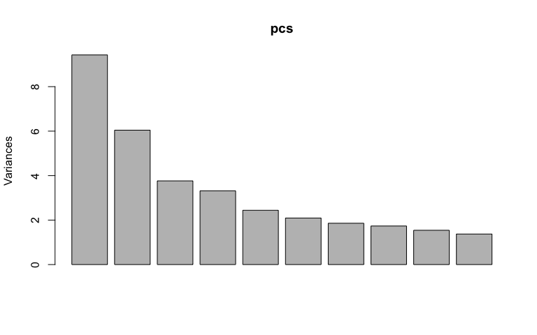
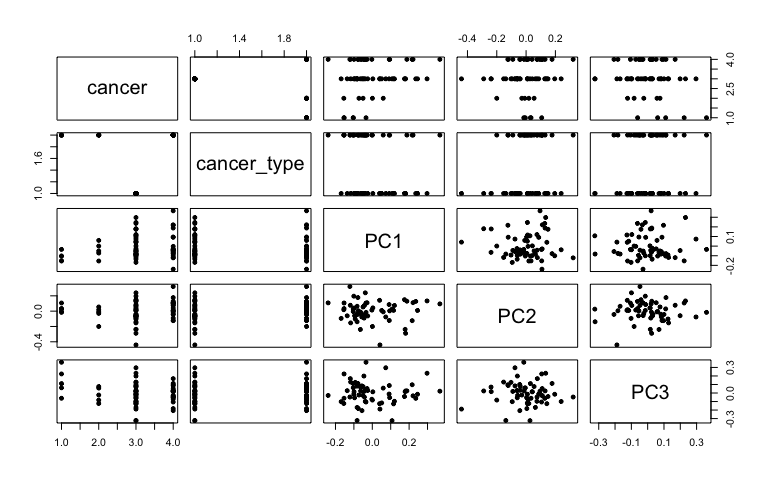
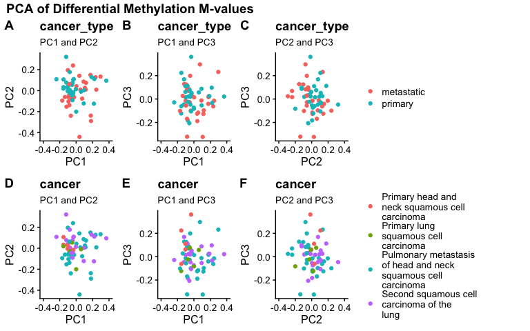

PCA\_final
================
Diana Lin
29/03/2020

Load the scaled beta-values:

``` r
if (!exists("metadata", inherits = FALSE) ) {
    metadata <- readRDS(file = here("data", "processed_data", "metadata.rds"))
}

if (!exists("expr_scaled", inherits = FALSE) ) {
    expr <- readRDS(file = here("data", "raw_data", "data.rds")) %>%
      column_to_rownames(var = "CG")
    expr_scaled <- t(scale(t(expr)))
}
```

``` r
pcs <- prcomp(na.omit(expr_scaled), center = FALSE, scale = FALSE)

plot(pcs)
```



``` r
prinComp <-
    cbind(metadata, pcs$rotation[metadata$sample, 1:10]) %>% 
    dplyr::select(-sample)
    
plot(prinComp[, c("cancer", "cancer_type", "PC1", "PC2", "PC3")], pch = 19, cex = 0.8)
```



``` r
kable(summary(pcs)$importance[,1:10])
```

|                        |      PC1 |      PC2 |      PC3 |      PC4 |     PC5 |      PC6 |      PC7 |      PC8 |      PC9 |     PC10 |
| ---------------------- | -------: | -------: | -------: | -------: | ------: | -------: | -------: | -------: | -------: | -------: |
| Standard deviation     | 3.070232 | 2.458283 | 1.940064 | 1.821268 | 1.56238 | 1.446769 | 1.363161 | 1.316925 | 1.241933 | 1.172004 |
| Proportion of Variance | 0.157110 | 0.100720 | 0.062730 | 0.055280 | 0.04068 | 0.034890 | 0.030970 | 0.028900 | 0.025710 | 0.022890 |
| Cumulative Proportion  | 0.157110 | 0.257820 | 0.320560 | 0.375840 | 0.41652 | 0.451410 | 0.482380 | 0.511280 | 0.536990 | 0.559880 |

``` r
pca <- function(pc1 = "PC1", pc2 = "PC2", var = "cancer_type") {
    ggplot(prinComp, aes(x = !!sym(pc1), y = !!sym(pc2))) +
        geom_point(aes(colour = !!sym(var))) +
        labs(title = var,
             subtitle = glue("{pc1} and {pc2}")) +
    #    scale_colour_discrete(labels = function(x) str_wrap(x, width = 13)) +
     #   guides(colour = guide_legend(nrow = 2)) +
        theme_cowplot(12) +
        xlim(c(-0.4,0.4))
}
p1 <- pca(pc1 = "PC1", pc2 = "PC2", var = "cancer_type") 
p2 <- pca(pc1 = "PC1", pc2 = "PC3", var = "cancer_type")
p3 <- pca(pc1 = "PC2", pc2 = "PC3", var = "cancer_type") 

p4 <- pca(pc1 = "PC1", pc2 = "PC2", var = "cancer") 
p5 <- pca(pc1 = "PC1", pc2 = "PC3", var = "cancer")
p6 <- pca(pc1 = "PC2", pc2 = "PC3", var = "cancer") 

p7 <- plot_grid(
    p1 + theme(legend.position = 'none'),
    p2 + theme(legend.position = 'none'),
    p3 + theme(legend.position = 'none'),
    labels =  c('A', 'B', 'C'),
    align = 'h',
    nrow = 1)
```

    ## Warning: Removed 1 rows containing missing values (geom_point).

``` r
p8 <- plot_grid(
    p4 + theme(legend.position = 'none'),
    p5 + theme(legend.position = 'none'),
    p6 + theme(legend.position = 'none'),
    labels = c('D', 'E', 'F'),
    align = 'h',
    nrow = 1
)
```

    ## Warning: Removed 1 rows containing missing values (geom_point).

``` r
legend1 <- get_legend(
  p1 + theme(legend.box.margin = margin(0, 0, 0, 12),
             legend.title = element_blank()) 
)

legend2 <- get_legend(
  p4 + theme(legend.box.margin = margin(0, 0, 0, 12),
      legend.title = element_blank()) + 
      scale_colour_discrete(labels = function(x) str_wrap(x, width = 20))# + 
  #    guides(colour = guide_legend(nrow = 2))
)

p9 <- plot_grid(p7, legend1, rel_widths = c(3, 1.5))
p10 <- plot_grid(p8, legend2, rel_widths = c(3, 1.5))

title <- ggdraw() + 
  draw_label(
    "PCA of Differential Methylation M-values",
    fontface = 'bold',
    x = 0,
    hjust = 0
  ) +
  theme(
    plot.margin = margin(0, 0, 0, 7)
  )

final <- plot_grid(title, p9, p10, ncol = 1, rel_heights = c(0.1, 1,1))

print(final)
```


